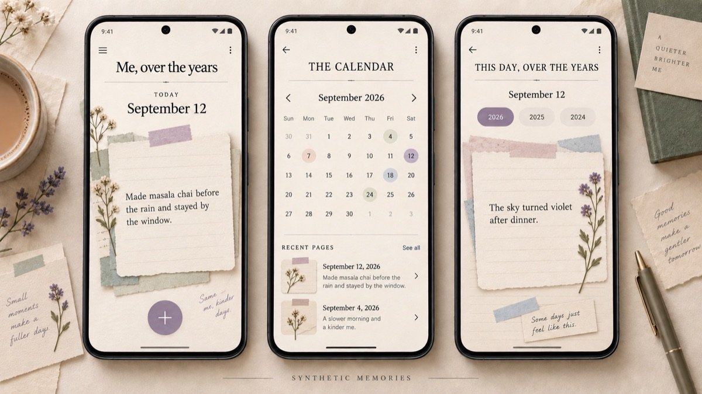

# Me, over the years

A private Android memory album for an audience of one: a quick place to save the little moments that are too small for a diary and too personal, ordinary, or precious to publish.

*Public product presentation using synthetic memories. See [the visual product notes](./VISUAL_PRODUCT.md).*

## The product belief

A memory does not need an audience to be worth keeping.

Most diary products begin with writing and storage. Me, over the years begins with return: save a small moment now, then meet it again on the same date months or years later. The app uses a tactile album metaphor so browsing feels like opening kept pages rather than managing a database.

## What I built

- Fast text-memory capture with an automatic date and time
- Today, calendar, and year-based ways to revisit entries
- A “this day, over the years” view for memories on the same calendar date
- An offline local SQLite store with no account or app-owned backend
- Manual export and non-destructive restore, including duplicate protection
- Permanently signed Android builds so updates can install without deleting local memories
- A warm, Japanese-stationery-inspired album interface built with Jetpack Compose

The product has moved through several real-device iterations: from a plain offline text diary, to a scrapbook foundation, to safer backup and update handling, and then to a more tactile memory-page stack, calendar, and year selector.

## Product rules

- One person, not a social network
- Android and offline-first
- No profile, login, analytics, ads, paid API, or app-owned cloud database
- Core memories remain on the device
- Sharing, if added, must be deliberate
- The interface should feel tactile and personal without competing with the user's words

## The privacy model

The Android app requests no internet permission for its core experience. Entries live in an on-device SQLite database. A manual JSON export exists for continuity, but it is readable plaintext and must be kept in a trusted location until encrypted backup is implemented.

The long-term direction is user-controlled, on-device encryption before a backup leaves the phone, with provider-agnostic destinations and no Me, over the years account.

## What I learned

For a private memory product, durability is part of the emotional experience. A beautiful capture flow is not enough if an update, uninstall, or lost signing key can separate someone from their memories. Backup, restore, stable signing, duplicate protection, and honest warnings therefore became product work, not supporting infrastructure.

The second lesson was visual: the album metaphor works only when it shapes interaction. Page stacks, date-based browsing, and returning to the same day across years matter more than decorative scrapbook elements on top of a generic feed.

## Current direction

The next priorities are editable or backdated memory dates, encrypted versioned backup, refined resurfacing rules, and eventually carefully selected photos. Automatic public sharing, social mechanics, and a cloud backend are deliberately out of scope.

## What this repository is

A public case study, visual product history, and system architecture. See `VISUAL_PRODUCT.md` and `ARCHITECTURE.md`.

The Android source, private product diary, device screenshots containing personal memories, backup files, signing material, and all memory data stay private. No application code is published here.

## Who built it

Yashasvi Shailly. Designed, built, tested, and used as a personal product.
