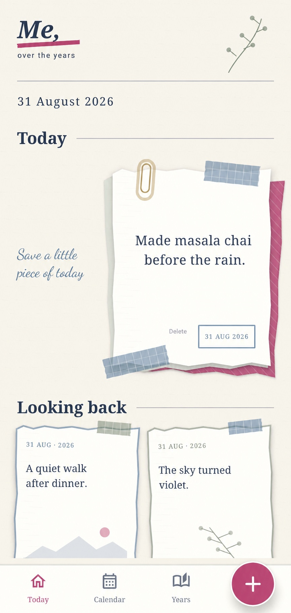
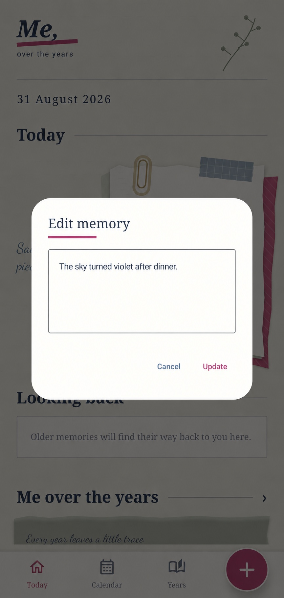

# Me, over the years, visual product

> These are sanitized versions of actual v0.3 device captures. Only the test-memory text was replaced with synthetic copy. They reveal the product's visual reasoning without publishing private diary content or application source.

  
  

## Current media boundary

The product documented here stores short text memories. It does not currently support image, video, or audio attachments. Photos and short video are planned as separate future releases rather than presented as shipped capabilities.

## The visual idea

The app is a memory album, not a productivity database and not a social feed. Its interface should make a short sentence feel worth keeping, then make returning to it feel like opening a page rather than querying a record.

The album metaphor therefore shapes navigation:

- **Today** is the page in front of you.
- **Calendar** is a map of days that hold something.
- **This day, over the years** stacks the same date across time.

## Product evolution

### 0.1 — A working offline diary

The first version proved the basic loop: capture text quickly, save its time, search, edit, delete, and keep everything in local SQLite. It was useful, but visually close to a conventional utility.

### 0.2 — The scrapbook identity

Warm paper, layered cards, a large final add control, calendar browsing, and year browsing established a distinct emotional language. The important shift was from a list of entries to pages that felt kept.

### 0.3 — Safety becomes part of the experience

Manual export and non-destructive restore, duplicate protection, stable signed updates, explicit memory actions, and a purpose-built launcher icon made the app safer to use with meaningful material. Softer shadows and layered surfaces added depth without changing the data model.

### 0.4 — Album as interaction

The home screen became a tactile page stack. Calendar returned as a month grid with marked days. Years became “This day, over the years,” with a clear selector and an honest empty state for years without a memory.

### Planned media release — Photos

Photos come first. The app will use Android's user-controlled Photo Picker, copy only selected images into app storage, create an optimized local version, show storage usage, and include media in tested export and restore. It will not request broad photo-library access.

### Later media release — Short video

Video will ship separately after photo storage and media backup are trustworthy. The version will need explicit clip selection, duration and storage limits, local playback, generated thumbnails, deletion that cleans up the local copy, and a tested restore path. Video will not be silently uploaded or synced.

## Visual language

- Warm paper and ink navy as the base
- Muted lavender, blush, moss, and dusty blue as restrained accents
- Editorial serif headings with legible controls
- Handwritten type only for brief decorative notes
- Rounded paper corners, faint notebook rules, offset layers, tape, and botanical details
- Shadows that suggest physical pages without turning the interface into decoration

## Deliberately rejected

- A generic social feed
- Followers, likes, public profiles, or engagement counts
- AI sparkle and star motifs
- A terracotta-led palette that makes the product feel like another brand
- Japanese-language decoration used only as an aesthetic prop
- Flat, repetitive dashboard cards
- Decorative elements that compete with the user's words

## The screenshot boundary

The screens above preserve the real v0.3 product layout and visual system. The visible memory copy is synthetic, and the original private source screenshots remain in the private product-history repository.

Photos and short video remain versioned future work and are intentionally absent from the current screenshots. Audio remains later. Real memories, unsanitized private screenshots, backup files, signing material, detailed UI assets, and application code remain private.
